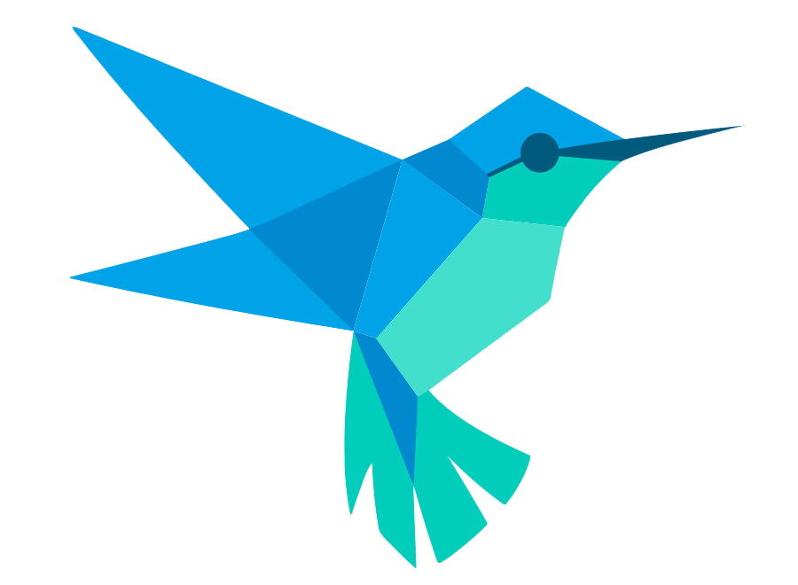

  <h1>Hi  I'm João Vitor Magaroti</h1>
    
I am a Mobile enthusiast and passionate about learning new technologies

    
   
   
    

 

  <a href="https://github.com/margarote">
  
  

  
 

### Mobile Development  

### Others Developments
 

   
   
   
    

 
 
 
